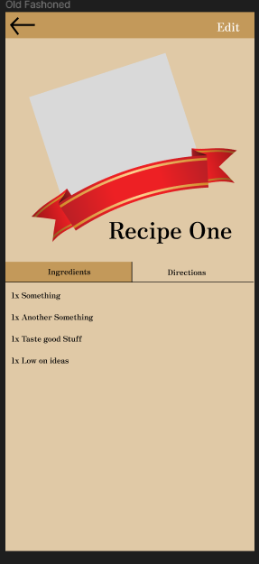

# Checkpoint 1

I am definately behind other people on the project because it took me so long to come up with an idea but I am happy with what I've landed on.

## Screens 
I haven't actually programmed any screens yet but I have created mockups for the main screens I plan on implementing.

#### Modern Recipe

#### Old Fashoned Recipe 

#### Select Menu

## Next steps
- [ ] I need to actually implement these screens, even if they end up just being mockups not grabbing data yet.
- [ ] Grab local data and throw it into the model
- [ ] Create an online database people may share recipes too

## Learning
* I have been trying to get Swift down a lot more before I start as it is such a different language from anything else.
* Also using sqlite will be fun when we get to that so data may actually be stored.

## Challenges
* Coming up with an app.  I wanted it to be original while not overcomplectaing it and everything I've come up with before sizzle has failed to match one of those requirements.
